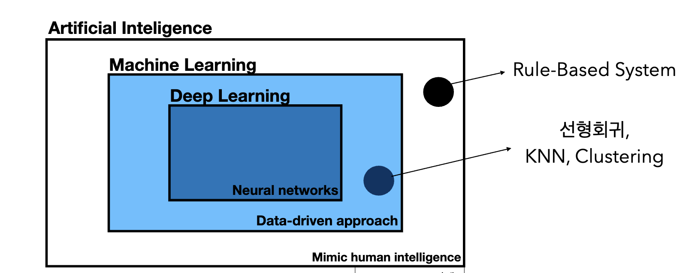
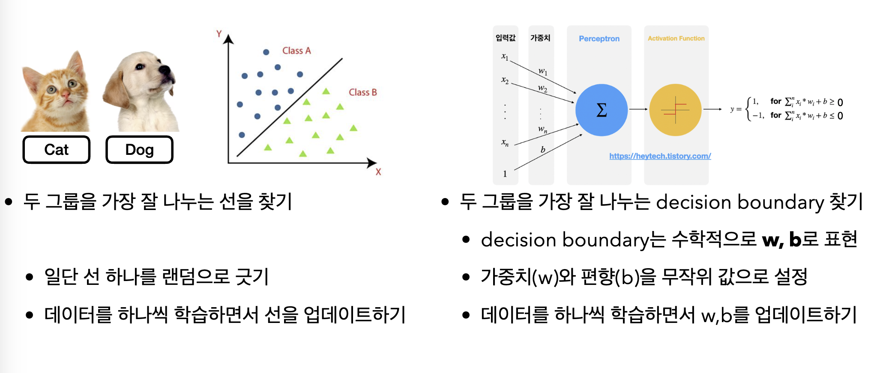
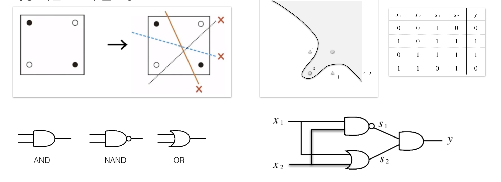

# Deep Learning Basic Week1

**목차**
- [ML/DL/AI의 차이](#mldlai의-차이)
- [모델이 데이터로 어떻게 학습할 것인가](#모델이-데이터로-어떻게-학습할-것인가)
- [DL의 Component](#dl의-component)
- [분류 문제와 퍼셉트론](#분류-문제와-퍼셉트론)
- [인경신공망과 역전파](#인경신공망과-역전파)

### ML/DL/AI의 차이

AI: 인간의 지능과 연결된 인지문제를 해결하는 알고리즘
ML: 데이터로부터 특징을 학습하는 알고리즘
DL: 신경망(Neural Network)를 기반으로 특징을 학습하는 알고리즘

### 모델이 데이터로 어떻게 학습할 것인가

- 지도학습(Supervised Learning)

	입력 데이터와 그에 대응하는 정답(라벨)이 합꼐 제공되는 학습 방법으로 개/고양이 Classification, 주식 가격 예측에 적합하다.

- 비지도학습(Unsupervised Learning)

	라벨이 없는 데이터를 사용하여 학습하는 방법이다.

	데이터의 내재된 구조를 학습하는 데 집중하며, 데이터 간의 유사성이나 군집을 찾는 작업에 사용되며, 데이터에 대한 더 깊은 통찰을 얻거나, 이후에 사용할 수 있는 특징을 추출한다.

	(Ex. Clustering, PCA, 우유를 산 고객이 빵도 살 확률, 추천시스템)

- 준지도학습(Semi-supervised Learning)

	소량의 고품질 레이블 데이터와 대량의 레이블 없는 데이터를 결합하여 학습한다.

	(Ex. 아이폰의 인물 분류 기능)

- 자가지도학습(Self-supervised Learning)

	레이블 없는 데이터에서 자동으로 지도 신호를 생성하여 학습한다.

	(Ex. LLM model Pretrain: 문장의 일부 단어를 가리고 이를 예측, 주어진 텍스트 다음에 올 단어를 예측)

### DL의 Component
	
- Data

	- 다루는 Task에 dependent(Classification, Semantic Segmentation, Object Detection, Pose Estimation)

	- 학습 데이터, 검증 데이터, 테스트 데이터
	
	- 모델의 성능을 좌우한다.

- Model

	- input에서 feature를 뽑고 우리가 원하는 output으로 변환하는 구조(CNN, RNN, Transformer)

- Loss function

	- 학습 중 알고리즘이 얼만큼 잘못 예측하나에 대한 지표

	- 알고리즘이 예측한 값과 실제 정답의 차이를 비교해 학습

	- 다루는 Task에 dependent

		- Regression Task: MSE

		- Classification Task: Cross Entropy

### 분류 문제와 퍼셉트론

- 강아지와 고양이를 분류하는 문제(이진분류)에서...

	1. 각 동물들의 사진에서 Feature 값(Ex. 귀가 얼만큼 둥근지, 꼬리가 얼만큼 짧은지)를 수치화하여서 주로 높은 차원에서 표현한다.
		
	2. 일단 선 하나를 랜덤으로 긋고, 데이터를 하나씩 학습하면서 선을 업데이트 해, 두 그룹을 가장 잘 나누는 선을 찾는다.

	

- 퍼셉트론
	
	1. 이진 분류 모델을 학습하기 위한 지도학습 기반의 알고리즘으로 오류를 최소화하는 방법으로 학습한다.

	2. 단층 퍼셉트론의 한계

		XOR 문제와 같이 데이터가 직선으로 분리되지 않는 경우 해결 불가능하다.

	3. 다층 퍼셉트론

		단층 퍼셉트론은 복잡한 패턴을 학습하는데 한계가 있으므로, 다층 퍼셉트론은 단층 퍼셉트론으로는 구현하지 못하는 것을 층을 늘리는 것으로 해결한다.

		

### 인경신공망과 역전파

1. 인공신경망: 입력 데이터와 출력 데이터의 관계를 학습하고 모델링하는 알고리즘
	
	- 다층 퍼셉트론(multi-layer Perceptron)
	
	- 합성곱 신경망(CNN)

	- 순환 신경망(RNN)

2. 역전파

	- 순전파와 역전파를 반복한다. 

	- 출력층에서 발생한 오차를 역으로 전파하면서 각 뉴런의 가중치를 조정한다.
	