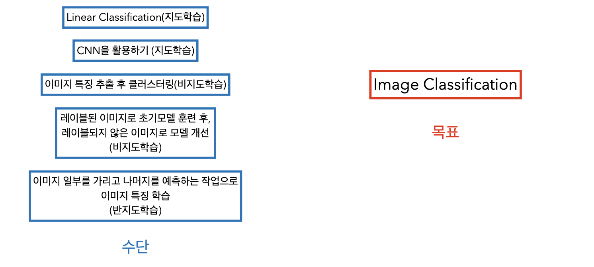

# Deep Learning Basic Week2

**목차**
- [이미지 분류](#이미지-분류)
- [이미지 데이터의 구조](#이미지-데이터의-구조)
- [기본적인 이미지 분류 접근 방식](#기본적인-이미지-분류-접근-방식)
- [CNN(Convolutional Neural Network, 합성곱 신경망)](#cnnconvolutional-neural-network-합성곱-신경망)

### 이미지 분류

- 이미지 분류
	- 이미지 분류란 컴퓨터가 주어진 이미지를 보고 이미지가 어떤 카테고리에 속하는지 판단하는 작업이다. 
	- 카테고리 개수에 따라 이진분류(Binary Classification), 다중 분류(Multi-class Classification)으로 나눌 수 있다.

- Image Classification이라고 다 지도학습인 것은 아니며 Image Classification이라는 목표를 이루기 위해 다양한 수단을 활용할 수 있다.

	

- 카카오맵 리뷰의 이미지 카테고리 분류나 네이버 식물검색등에 활용된다.

### 이미지 데이터의 구조

- 디지털 이미지의 구조

	- 픽셀(Pixel)
	- 채널(Channel): 간단히 RGB정도로 인식하자...
	- 해상도(Resolution)

- 이미지를 숫자로 표현하는 방법
	
	- 컴퓨터는 이미지를 숫자의 배열, 행렬로 인식한다.

	

## In Progress

### 기본적인 이미지 분류 접근 방식

- Raw-pixel을 이용한 비교

- 차이의 측정 방법(L1,L2)

- 선형분류기

- 한계점

### CNN(Convolutional Neural Network, 합성곱 신경망)

마지막 페이지 참조...

각 필터는 특정 패턴을 감지하도록 학습

- FNN vs CNN:

- Convolution Layer

- Pooling Layer

