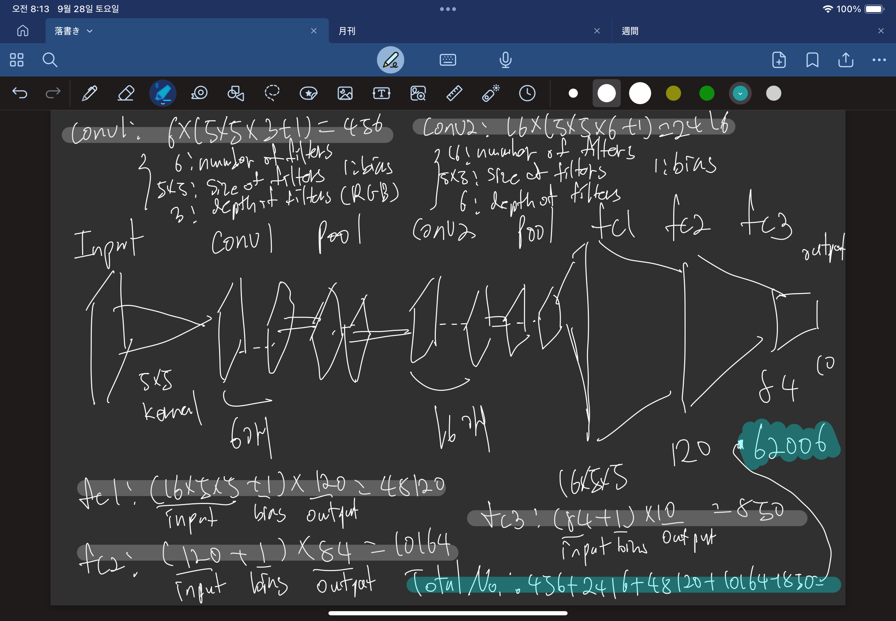

# Deep Learning Basic Week2

**목차**
- [이미지 분류](#이미지-분류)
- [이미지 데이터의 구조](#이미지-데이터의-구조)
- [기본적인 이미지 분류 접근 방식](#기본적인-이미지-분류-접근-방식)
- [CNN(Convolutional Neural Network, 합성곱 신경망)](#cnnconvolutional-neural-network-합성곱-신경망)

### 이미지 분류

- 이미지 분류
	- 이미지 분류란 컴퓨터가 주어진 이미지를 보고 이미지가 어떤 카테고리에 속하는지 판단하는 작업이다. 
	- 카테고리 개수에 따라 이진분류(Binary Classification), 다중 분류(Multi-class Classification)으로 나눌 수 있다.

- Image Classification이라고 다 지도학습인 것은 아니며 Image Classification이라는 목표를 이루기 위해 다양한 수단을 활용할 수 있다.

	

- 카카오맵 리뷰의 이미지 카테고리 분류나 네이버 식물검색등에 활용된다.

### 이미지 데이터의 구조

- 디지털 이미지의 구조

	- 픽셀(Pixel)
	- 채널(Channel): 간단히 RGB정도로 인식하자...
	- 해상도(Resolution)

- 이미지를 숫자로 표현하는 방법
	
	- 컴퓨터는 이미지를 숫자의 배열, 행렬로 인식한다.

	

### 기본적인 이미지 분류 접근 방식

- Raw-pixel을 이용한 비교 : 이미지의 픽셀 값을 직접 비교하여 유사성을 판단
	
	1. 모든 이미지를 같은 크기로 조정한다.(eg.32*32px)
	
	2. 각 이미지를 1차원 벡터로 펼친다.(32*32=1024차원)
	
	3. 새로운 이미지와 기존 이미지들의 벡터 간 거리를 계산한다.
	
	4. 가장 거리가 가까운 이미지의 클래스로 새 이미지를 분류한다.

- 차이의 측정 방법(L1,L2)
	
	
	
	

- 선형분류기(Linear Classifier)

	
	
	W를 이미지화 해보면 아래와 같이 나온다... 열심히 보면 각 대상의 중첩된 형체같은게 보인다고 한다...
	
	

- 한계점

	- 아래의 이미지의 예시인 경우, Boxed된 대상과 Shifted된 대상은 다른 대상이라고 할 수 있으나, 달라진 Pixel의 차이는 비슷할 수 있어, Original 이미지와의 차이가 비슷하다고 처리된다. Tinted의 경우 많은 Pixel값이 변경되므로 더 심할 수 있다.
		
		
	
	- 시점 차이, 조명의 변화, 같은 카테고리의 대상이더라도 다른 포즈, 일부가 가려진 사진 등 다양한 데이터셋에서도 대상을 분류할 수 있는 Robust한 분류기를 만들 필요성이 있다.

### CNN(Convolutional Neural Network, 합성곱 신경망)

Convolution Layer, Pooling Layer, Fully Connected Layer로 구성되어있다.

Convolution Layer 와 Pooling Layer를 반복하며 Fully Connected Layer에서 추출된 특징들을 종합하여 최종 분류를 수행한다.


- FNN vs CNN:
	
	
	
	- FNN
		- 입력 데이터를 1차원으로 펼쳐서 처리한다.
		- 인접 픽셀간의 상관관계가 무시되어 이미지를 벡터화하는 과정에서 정보손실이 발생한다.
	- CNN
		- 2차원 구조를 그대로 유지하며 분석한다.
		- 필터를 사용해서 Feature map을 얻는다.

- Convolution Layer

	- 입력 이미지에 다양한 필터를 적용하여 특징을 추출하며, 각 필터는 특정 패턴을 감지하도록 학습한다.

	- Convolution

		

		작은 가중치의 행렬인 filter(또는 kernel)이 특징을 찾아낸다.

	- Activation

		- 선형 변환의 연속만으로는 복잡한 함수를 표현할 수 없다.
		- 활성화 함수 없이 여러 층을 쌓아도 결국 하나의 선형 변환으로 축소된다.
		- 비선형 활성화 함수는 각 층에서 더 복잡하고 추상적인 특징을 학습할 수 있게 해준다.
		
		

- Pooling Layer

	- Feature map의 크기를 줄이면서도 특정 영역에서 가장 강한 특징만을 선택한다. 계산량이 감소하고 약간의 위치 변화에도 내성이 있다.

	

- Fully Connected Layer

	- 이전 층의 모든 뉴런과 연결되어 추출된 특징들을 종합하여 최종 분류를 수행한다.
	- Flatten 되기 전의 특징 맵들은 이미지의 다양한 고수준 특징을 나타내며, 이 특징들은 이미 공간적 관계를 인코딩하고 있다.

- Parameters

	```python
	class Net(nn.Module):
    def __init__(self):
        super().__init__()
        self.conv1 = nn.Conv2d(3, 6, 5)
        self.pool = nn.MaxPool2d(2, 2)
        self.conv2 = nn.Conv2d(6, 16, 5)
        self.fc1 = nn.Linear(16 * 5 * 5, 120)
        self.fc2 = nn.Linear(120, 84)
        self.fc3 = nn.Linear(84, 10)

    def forward(self, x):
        x = self.pool(F.relu(self.conv1(x)))
        x = self.pool(F.relu(self.conv2(x)))
        x = torch.flatten(x, 1) # 배치를 제외한 모든 차원을 평탄화(flatten)
        x = F.relu(self.fc1(x))
        x = F.relu(self.fc2(x))
        x = self.fc3(x)
        return x
	```

	위의 `Net`에서 학습되는 파라미터 개수는 다음과 같이 구할 수 있다.

	

	`conv2`의 depth는 `conv1`의 filter 수와 동일하다.